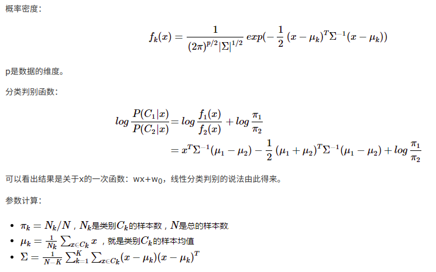

#度量学习的学习
>这一篇笔记主要学习了：
线性分类判别（Linear discriminant analysis，LDA），
二次分类判别（quadratic discrimination analysis，QDA），
Fish线性判据，以及python机器学习库scikit-learn 的使用

##一、知识学习
###LDA
对于一个二分类问题，LDA针对的是服从高斯分布且均值不同方差不同
时的情况。对于公式

对于公式１，**x**是一个ｐ维向量

对于公式二，可以看出里面的对数比第二项代表的是每个随机变量分量
的样本数目之比。
###QDA
QDA可以方差均值均不同。
如果方差相同，问题可以通过一次解决，如若方差不同，则必须利用二
次来解决。
下图是一个示意：

因此QDA适应性更好。判别式如下：

将这个式子的两个均值都取0，便可以得到度量学习中需要学习的表达式了
也就是图片的第一部分
###Fisher判据

>投影后最小化类内误差，最大化类间误差

